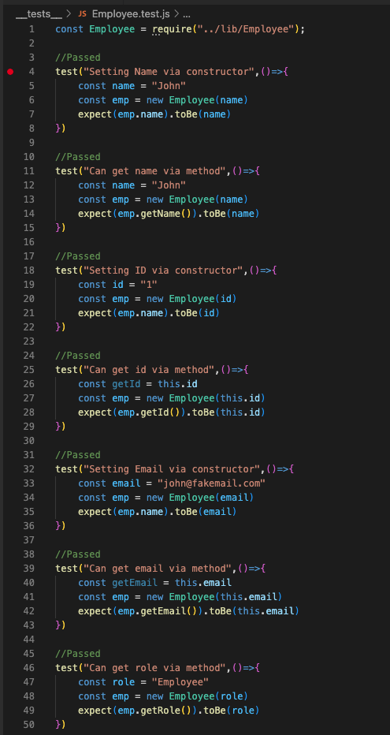
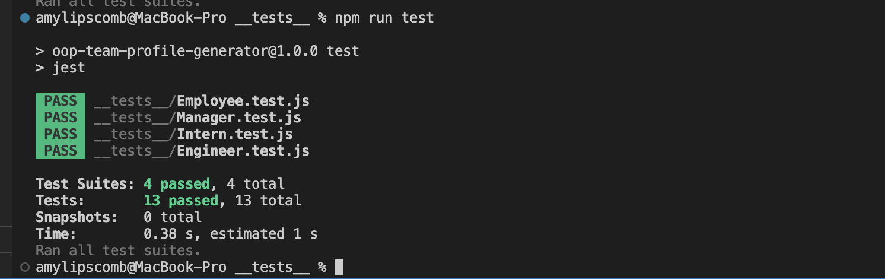

# How to Use OOP to Generate a Team Organizer 
  

## Description

 When creating a team, there's always certain roles that need to be filled. I utilized OOP (Object Oriented Programming) to create a team. OOP is extremely helpful, because it uses the DRY method, also known as 'Don't Repeat Yourself'. This basically means that duplicate code isn't created. For the team created, the following positions were filled: Manager, Engineer and Intern. Each position had similiar information that needed to be filled out, like:

 * Name
 * Role 
 * Id 
 * Email

 However, there were also a few differences. For a manager, the office number had to be displayed, whereas for engineers, their GitHubs had to be shared. The only other item that was needed for the intern, was the name of their school. To see the steps I've taken within the terminal, please continue to read along, as well as watch my [step-by-step video](). I hope you enjoy and learn something new! 

----
## Table of Contents 

  * [Installation](#installation)
  * [Usage](#usage)
  * [License](#license)
  * [Contribution](#contribution)
  * [Tests](#tests)
  * [Questions](#questions)

---
## Installation

I downloaded the npm package, inquirer. I used the following command lines:

```
npm init -y
npm i inquirer@8.2.4 --save
```

I also installed jest, which allows users to run tests within the terminal. 

```
npm i jest
```

---

## Usage

I used jest to run tests in order to see if the expected result is received. If it's successful, it will show that the suite or tests passed. If they did not pass, it will show the user the following information:
* The test that failed,
* The expected result versus the result that was actually received and, 
* A hint as to what needs to be fixed within the test. 

---

## Contribution

  None.

  ---

## License

```
This project is licensed under MIT.
```

---


## Tests

Within this repo, four javascript test files were created, and within each file, several tests were included. Below is a screenshot of the "Employee" tests I created. 




After several trial and errors, all of the tests finally passed! See below:



 ---

## Questions

If you'd like to see more of my projects, check out my github: [amylipscomb](https://github.com/amylipscomb).
For further information please contact me at [amy.a.lipscomb@gmail.com](mailto:amy.a.lipscomb@gmail.com)!